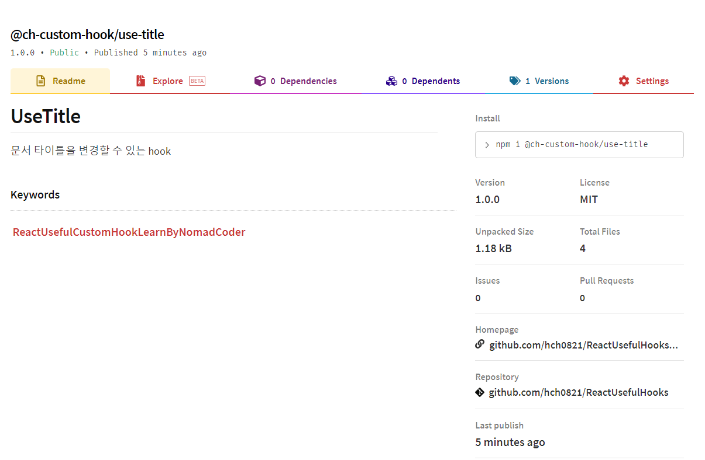
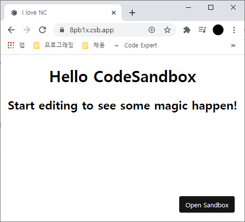

# 리액트 - 유용한 커스텀 Hook
[노마드코더 - 실전형 리액트 Hooks 10개](https://nomadcoders.co/react-hooks-introduction/)에서 학습한 리액트에서 유용하게 사용할 수 있는 커스텀 훅, 모듈 publish 방법을 정리한 레포지토리입니다.

## 유용한 커스텀 훅 목록
* [useAxios](./useAxios)
* [useBeforeLeave](./useBeforeLeave)
* [useClick](./useClick)
* [useConfirm](./useConfirm)
* [useFadeIn](./useFadeIn)
* [useFullScreen](./useFullScreen)
* [useInput](./useInput)
* [useNetwork](./useNetwork)
* [useNotification](./useNotification)
* [usePreventLeave](./usePreventLeave)
* [useScroll](./useScroll)
* [useTab](./useTab)
* [useTitle](./useTitle)

## npm에 모듈 publish 방법

### npm init
```bash
cd useTitle
npm init
package name: @ch-custom-hook/use-title
version: (1.0.0)
description: 문서 타이틀을 변경할 수 있는 hook
entry point: (index.js)
git repository: https://github.com/hch0821/ReactUsefulHooks
keywords: react, react hooks, title
author: CH Hwang <hch0821@gmail.com>
license: (ISC) MIT
```

### 필요한 모듈 설치 및 package.json에 명시
```bash
npm i react react-dom --save
```
#### dependencies-> peerDependencies로 변경
peerDependencies는 모듈 사용자가 이미 해당 모듈이 설치되어있을 경우, 다시 설치하지 않는 것을 뜻함.
```js
{
    "peerDependencies":{
        "react": "^16.8.6",
        "react-dom": "^16.8.6"
    }
}
```

### npm 사이트에서 조직 생성
1. npm에 회원 가입이 안 되어있으면, 회원 가입 (이메일 인증 필요)
2. https://www.npmjs.com/org/create 에 접속 후, package name의 / 앞 부분 (ex. ch-custom-hook) 입력
3. https://www.npmjs.com/settings/ch-custom-hook/members 과 같은 결과 확인

### npm에 로그인
```bash
Username: your username
Password:
Email: (this IS public) your email
Logged in as username on https://registry.npmjs.org/.
```

### npm에 publish
```bash
npm publish --access public
```

### publish 결과



## 모듈 테스트
### 코드 샌드박스에서 테스트
1. https://codesandbox.io/ 접속
2. React 템플릿 선택
3. dependencies에 @ch-custom-hook/use-title 입력하면 자동으로 모듈 설치됨
4. App.js에 다음과 같이 입력
```jsx
import React from "react";
import "./styles.css";
import useTitle from "@ch-custom-hook/use-title"; // 만든 모듈 추가
export default function App() {
  useTitle("I love NC");
  return (
    <div className="App">
      <h1>Hello CodeSandbox</h1>
      <h2>Start editing to see some magic happen!</h2>
    </div>
  );
}
```
#### 배포된 모듈 테스트 결과
useTitle 훅을 이용하여 문서 제목이 "I love NC"로 바뀐 것을 알 수 있다.


### 로컬에서 테스트
```bash
npm i @ch-custom-hook/use-title
```  
